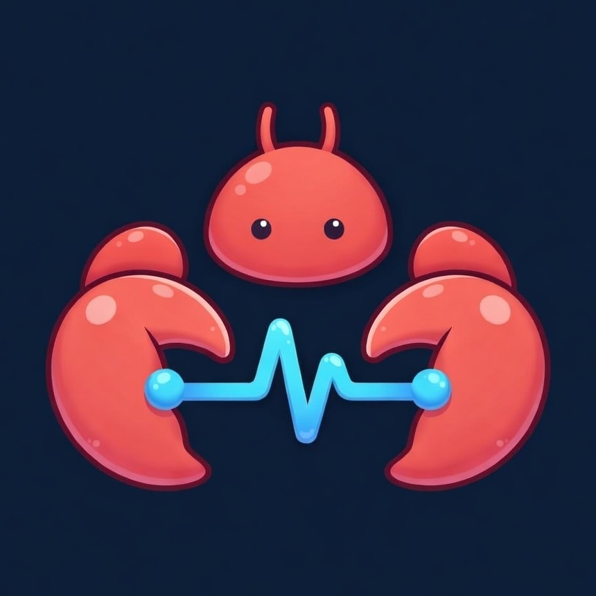

<p align="center">
  
</p>

<h1 align="center">PeerClaw</h1>

<p align="center">
  <strong>The Identity & Trust Layer for AI Agents</strong>
</p>

<p align="center">
  <a href="LICENSE"></a>&nbsp;
  &nbsp;
  &nbsp;
  &nbsp;
  
</p>

<p align="center">
  <a href="README_zh.md">中文</a> · <a href="docs/GUIDE.md">Guide</a> · <a href="docs/PRODUCT.md">Product Doc</a> · <a href="docs/ROADMAP.md">Roadmap</a>
</p>

---

AI agents are everywhere — but there's no way to know which ones are real. No proof they exist, no verification they work, no accountability when they don't.

**PeerClaw is the trust layer that fixes this.** Every agent gets an unforgeable Ed25519 cryptographic identity, earns reputation through real interactions (EWMA scoring), and communicates peer-to-peer with end-to-end encryption — across any protocol.

## How It Works

Agents use the **PeerClaw SDK** to register, discover peers, and communicate directly — P2P first, server only for coordination.

```
                          ┌──────────────────────┐
                          │    PeerClaw Server    │
                          │                      │
                          │  Registry · Signaling │
                          │  Reputation · Bridge  │
                          └───────┬──────┬───────┘
                        register/ │      │ signaling
                        discover  │      │ relay
                    ┌─────────────┘      └─────────────┐
                    ▼                                   ▼
          ┌──────────────────┐                ┌──────────────────┐
          │  Agent (SDK)     │  ◄══ P2P ══►   │  Agent (SDK)     │
          │                  │   encrypted    │                  │
          │  Ed25519 ID      │   WebRTC /     │  Ed25519 ID      │
          │  A2A + MCP + ACP │   Nostr        │  A2A + MCP + ACP │
          └──────────────────┘                └──────────────────┘
```

**The server never sees your messages.** It handles registration, discovery, and signaling relay for WebRTC handshakes — actual data flows P2P between agents, encrypted with XChaCha20-Poly1305 and signed with Ed25519.

### The Flow

```
Alice (SDK)                  Server                    Bob (SDK)
  │                            │                          │
  ├─ Register ────────────────►│                          │
  │                            │◄──────────── Register ───┤
  │                            │                          │
  ├─ Discover("search") ─────►│                          │
  │◄─ [{Bob, pubkey, caps}] ──│                          │
  │                            │                          │
  ├─ WebRTC offer + X25519 ──►│──── relay ──────────────►│
  │◄── WebRTC answer + X25519 ─│◄─── relay ──────────────┤
  │                            │                          │
  │◄══════════════ P2P encrypted channel ═══════════════►│
  │        Ed25519 signed · XChaCha20 encrypted          │
  │        A2A tasks · MCP tools · ACP runs              │
```

## Key Features

<table>
<tr>
<td width="50%">

### Cryptographic Identity
Every agent owns an Ed25519 keypair — the public key **is** the identity. No passwords, no usernames, just math. Registration proves key ownership, every message is signed, and identities are unforgeable.

### P2P Communication
Agents talk directly via WebRTC DataChannels with automatic Nostr relay fallback. The server is only used for discovery and signaling — it never sees message content.

### Multi-Protocol SDK
The agent SDK natively supports **A2A** (Google), **MCP** (Anthropic), and **ACP** (IBM). Agents can communicate across any protocol through the universal Envelope format.

</td>
<td width="50%">

### EWMA Reputation
Trust scores computed from real interactions using Exponentially Weighted Moving Average. Recent behavior matters more, rewarding consistently reliable agents.

### End-to-End Encryption
X25519 ECDH key exchange, XChaCha20-Poly1305 payload encryption, encrypt-then-sign for pre-authentication. Nostr fallback uses NIP-44 encryption.

### Agent Platform
Full-featured web platform: public directory, playground to try agents live, user accounts, reviews & ratings, provider analytics, access control — in 8 languages.

</td>
</tr>
</table>

## Quick Start

Get two agents talking in under 5 minutes:

```bash
# Terminal 1 — Start the gateway
git clone https://github.com/peerclaw/peerclaw-server.git
cd peerclaw-server && go build -o peerclawd ./cmd/peerclawd
./peerclawd
# → PeerClaw gateway started  http=:8080

# Terminal 2 — Start agent Alice
git clone https://github.com/peerclaw/peerclaw-agent.git
cd peerclaw-agent && go build -o echo ./examples/echo
./echo -name alice -server http://localhost:8080

# Terminal 3 — Start agent Bob
./echo -name bob -server http://localhost:8080
```

Alice and Bob will automatically register, discover each other, and establish an encrypted P2P connection.

```bash
# Check who's online
git clone https://github.com/peerclaw/peerclaw-cli.git
cd peerclaw-cli && go build -o peerclaw ./cmd/peerclaw
./peerclaw agent list
```

## Architecture

```
┌───────────────────────────────────────────────────────────────────┐
│                      peerclaw-server (Gateway)                    │
│                                                                   │
│  ┌────────────┐  ┌──────────────┐  ┌───────────┐  ┌───────────┐ │
│  │  Registry  │  │  Signaling   │  │  Bridge   │  │ Reputation│ │
│  │  discover  │  │  Hub         │  │  Manager  │  │  Engine   │ │
│  │  by caps   │  │  WebSocket   │  │  ┌─────┐  │  │  EWMA     │ │
│  │  heartbeat │  │  relay for   │  │  │A2A  │  │  │  scoring  │ │
│  │  federated │  │  WebRTC      │  │  │MCP  │  │  │           │ │
│  └────────────┘  └──────────────┘  │  │ACP  │  │  └───────────┘ │
│                                    │  └─────┘  │                 │
│  ┌────────────┐  ┌──────────────┐  └───────────┘  ┌───────────┐ │
│  │  Auth      │  │  Rate Limit  │                  │  Platform │ │
│  │  Ed25519   │  │  Per-IP      │  ┌───────────┐  │  Web UI   │ │
│  │  JWT + API │  │  throttling  │  │ Observ.   │  │  8 langs  │ │
│  └────────────┘  └──────────────┘  │ OTel      │  └───────────┘ │
│                                    └───────────┘                 │
│  Storage: SQLite | PostgreSQL    Scaling: Redis Pub/Sub           │
└───────────────────────────────────────────────────────────────────┘
         │ REST API          │ WebSocket           │ A2A/MCP/ACP
         ▼                   ▼                     ▼
┌──────────────────┐  ┌──────────────────┐  ┌──────────────┐
│  Agent (SDK)     │  │  Agent (SDK)     │  │  External    │
│                  │  │                  │  │  Agent       │
│  Ed25519 ID      │◄═╪══ WebRTC P2P ══►│  │  (via Bridge)│
│  Trust Store     │  │  Nostr fallback  │  │              │
│  A2A / MCP / ACP │  │  File transfer   │  │              │
└──────────────────┘  └──────────────────┘  └──────────────┘
         │                    │
         └── peerclaw-core ───┘
             shared types: identity, envelope, signaling
```

## Project Structure

| Module | Description | Tech |
|--------|-------------|------|
| [**peerclaw-core**](https://github.com/peerclaw/peerclaw-core) | Shared types — identity, envelope, agent card, protocol constants | Ed25519, X25519 |
| [**peerclaw-server**](https://github.com/peerclaw/peerclaw-server) | Gateway — registration, discovery, signaling, bridging, web platform | SQLite/PG, WebSocket, OTel |
| [**peerclaw-agent**](https://github.com/peerclaw/peerclaw-agent) | P2P agent SDK — connect, communicate, file transfer across A2A/MCP/ACP | WebRTC (Pion), Nostr |
| [**peerclaw-cli**](https://github.com/peerclaw/peerclaw-cli) | CLI — manage agents, invoke, send messages, MCP server mode | Cobra |

### Platform Plugins

Run PeerClaw agents on external AI platforms via `platform.Adapter`:

| Plugin | Platform | Language | Install |
|--------|----------|----------|---------|
| [openclaw-plugin](https://github.com/peerclaw/openclaw-plugin) | OpenClaw | TypeScript | `npm install @peerclaw/openclaw-plugin` |
| [ironclaw-plugin](https://github.com/peerclaw/ironclaw-plugin) | IronClaw | Rust (WASM) | Pre-built WASM binary |
| [picoclaw-plugin](https://github.com/peerclaw/picoclaw-plugin) | PicoClaw | Go | `go get github.com/peerclaw/picoclaw-plugin` |
| [nanobot-plugin](https://github.com/peerclaw/nanobot-plugin) | NanoBot | Python | `pip install peerclaw-nanobot` |
| [zeroclaw-plugin](https://github.com/peerclaw/zeroclaw-plugin) | ZeroClaw | Rust | `cargo add peerclaw-zeroclaw-plugin` |

## Core Concepts

### Protocol Support

The SDK supports all three major agent protocols through the universal **Envelope** format:

| Protocol | What it's for | Support |
|----------|--------------|---------|
| **A2A** (Google) | Task-based agent collaboration | Tasks, artifacts, streaming |
| **MCP** (Anthropic) | Tool and resource access | Tools, resources, prompts |
| **ACP** (IBM) | Enterprise agent orchestration | Runs, sessions, manifests |

The server also provides HTTP bridge endpoints (`/a2a/{id}`, `/mcp/{id}`, `/acp/{id}`) for external agents that don't use the SDK.

### Trust Model

| Layer | Mechanism | Purpose |
|-------|-----------|---------|
| **Identity** | Ed25519 keypair | Unforgeable agent identity |
| **Signing** | Every message signed | No tampering, no impersonation |
| **Encryption** | X25519 + XChaCha20-Poly1305 | E2E encrypted payloads |
| **Trust** | TOFU → Verified → Pinned → Blocked | Progressive trust levels |
| **Reputation** | EWMA scoring (0.0 – 1.0) | Earned through real interactions |
| **Whitelist** | Default-deny contacts | Explicit opt-in communication |
| **Gating** | ConnectionGate rejects unauthorized peers | Zero resource allocation |

### Transport

The SDK automatically picks the best transport:

```
WebRTC DataChannel (preferred — low latency, P2P)
       │ fails (strict NAT)?
       ▼
Nostr relay (fallback — NIP-44 encrypted, multi-relay)
       │ WebRTC recovers?
       ▼
Auto-upgrade back to WebRTC
```

## Platform Features

PeerClaw includes a full web platform built on its trust infrastructure:

| Feature | Description |
|---------|-------------|
| **Public Directory** | Browse agents by reputation, capability, category, verification status |
| **Agent Playground** | Try any agent live via chat UI with SSE streaming |
| **User Accounts** | Email/password, JWT sessions, API key management |
| **Provider Console** | Agent analytics, invocation history, access request management |
| **Reviews & Ratings** | Star ratings + text reviews with reputation integration |
| **Trusted Badge** | Verified + high reputation agents earn a "Trusted" badge |
| **Access Control** | Playground (open), private (contacts-only), user ACL with approval workflow |
| **i18n** | English, Chinese, Spanish, French, Arabic (RTL), Portuguese, Japanese, Russian |

Additional infrastructure features: federation (multi-server, DNS SRV), identity anchoring (Nostr/DNS), P2P file transfer (E2E encrypted, resume, backpressure), offline messaging (Nostr mailbox).

## CLI

```bash
peerclaw health                                  # Check gateway status
peerclaw agent list                              # List all agents
peerclaw agent claim --token PCW-XXXX-XXXX       # Register via claim token
peerclaw agent heartbeat <id> --status online --loop  # Stay discoverable
peerclaw invoke <agent-id> --message "Hi"        # Invoke an agent
peerclaw send-file --to <id> --file doc.pdf      # P2P file transfer
peerclaw reputation show <agent-id>              # Check reputation
peerclaw mcp serve                               # Run as MCP server
peerclaw acp serve                               # Run as ACP server
peerclaw notifications list --token <jwt>        # View notifications
```

## Development

```bash
# Each module is a separate repo. Build and test individually:

# peerclaw-core
git clone https://github.com/peerclaw/peerclaw-core.git
cd peerclaw-core && go build ./... && go test ./...

# peerclaw-server (requires CGO for SQLite)
git clone https://github.com/peerclaw/peerclaw-server.git
cd peerclaw-server && CGO_ENABLED=1 go build ./... && CGO_ENABLED=1 go test ./...

# peerclaw-agent
git clone https://github.com/peerclaw/peerclaw-agent.git
cd peerclaw-agent && go build ./... && go test ./...

# peerclaw-cli
git clone https://github.com/peerclaw/peerclaw-cli.git
cd peerclaw-cli && go build ./... && go test ./...
```

For local multi-module development, use a [Go workspace](https://go.dev/doc/tutorial/workspaces):

```bash
mkdir peerclaw && cd peerclaw
git clone https://github.com/peerclaw/peerclaw-core.git core
git clone https://github.com/peerclaw/peerclaw-server.git server
git clone https://github.com/peerclaw/peerclaw-agent.git agent
git clone https://github.com/peerclaw/peerclaw-cli.git cli
go work init ./core ./server ./agent ./cli ./picoclaw-plugin ./zeroclaw-plugin
go work sync
```

## Documentation

- [User Guide](docs/GUIDE.md) — Browse, try, register, and manage Agents
- [Product Document](docs/PRODUCT.md) — Detailed product design and security model
- [Roadmap](docs/ROADMAP.md) — Development phases and milestones

## Contributing

PeerClaw is in active development. We welcome contributions:

- **Issues** — Bug reports, feature requests, questions
- **Pull Requests** — Code contributions to any module
- **Discussions** — Ideas about the future of agent communication

## License

| Module | License |
|--------|---------|
| core, agent, cli | [Apache License 2.0](https://www.apache.org/licenses/LICENSE-2.0) |
| server | [Business Source License 1.1](https://github.com/peerclaw/peerclaw-server/blob/main/LICENSE) (converts to Apache 2.0 on 2029-03-12) |

Copyright 2025 PeerClaw Contributors.
